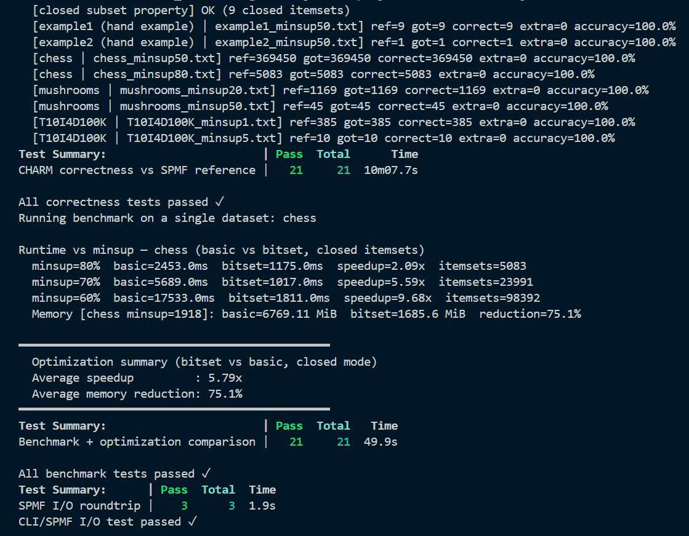

# Charm_Data-Mining-Lab-2


Triển khai từ đầu thuật toán khai thác tập phổ biến dựa trên tidset bằng Julia (>=1.9), hỗ trợ:

- **Tập phổ biến đóng** (`output_mode=:closed`, tìm kiếm theo thuộc tính kiểu CHARM)
- Hai cách cài đặt:
  - `:basic` (tidset dạng Set)
  - `:bitset` (tidset dạng BitVector, tối ưu hóa)

## Cài đặt môi trường

### Yêu cầu

- Julia **1.9+**

### Cài đặt dependencies

```bash
julia --project=. -e 'using Pkg; Pkg.instantiate()'
```

## Hướng dẫn chạy

### Chạy từ Julia REPL

```julia
include("src/algorithm/charm.jl")
txns = read_spmf_transactions("data/toy/toy1.txt")
result = charm(txns, 2; implementation=:bitset)
print_results(result)
write_spmf_itemsets(result, "results/toy1_out.txt")
```

### Chạy qua CLI

```bash
julia --project=. src/cli.jl \
  --input data/toy/toy1.txt \
  --output results/toy1_cli_out.txt \
  --minsup 2 \
  --impl bitset
```

Các tùy chọn:

- `--minsup`: giá trị tuyệt đối (vd: `2`) hoặc tương đối (vd: `0.05`)
- `--impl`: `basic` hoặc `bitset`

## Kiểm thử tự động

Chạy toàn bộ bộ kiểm thử tự động bằng:

```bash
julia --project=. test/runtests.jl
```

Bộ kiểm thử bao gồm các test về tính đúng đắn, hiệu năng và I/O theo quy trình end-to-end.

Kết quả:



## Quy trình đánh giá (Evaluation)

### Bước 1 — Tải dữ liệu benchmark bằng SPMF

Trước khi chạy script đánh giá, cần tải các file dữ liệu benchmark từ [trang SPMF Datasets](https://www.philippe-fournier-viger.com/spmf/index.php?link=datasets.php) về thư mục `data/benchmark/`. Tiếp theo đó chạy script `scripts/run_spmf.bat` để chạy spmf.jar để chạy các dataset trên với các minsup khác nhau.

**Chạy script dữ liệu (Windows):**

```powershell
scripts\run_spmf.bat
```

> **Lưu ý:**
> - Script yêu cầu có kết nối Internet và Java được cài đặt sẵn trên máy.
> - Chạy script từ thư mục gốc của dự án.
> - Sau khi hoàn tất, kiểm tra thư mục `data/benchmark/` để đảm bảo các file sau đã có mặt:
>   - `chess.txt`
>   - `mushroom.txt`
>   - `retail.txt`
>   - `T10I4D100K.txt`
> - Ngoài ra, xem các giá trị thời gian của từng dataset theo từng minsup để điền thủ công vào file data/reference/spmf/spmf_times.csv

### Bước 2 — Chạy script đánh giá

```bash
julia --project=. scripts/evaluate.jl
```

Các báo cáo CSV được tạo ra sẽ được ghi vào thư mục `results/`.

## Chương 5 — Phân tích giỏ hàng (Market Basket Analysis)

Ứng dụng thực tế của CHARM trên bộ dữ liệu bán lẻ thực, sinh luật kết hợp và phân tích ý nghĩa kinh doanh. Toàn bộ pipeline được minh họa trong `notebooks/demo.ipynb`.

### Bài toán

**Market Basket Analysis** tìm các mẫu mua sắm đồng thời từ lịch sử giao dịch và biểu diễn chúng dưới dạng luật kết hợp:

```
X ⇒ Y   với  sup(X ∪ Y) ≥ minsup  và  conf(X ⇒ Y) ≥ minconf
```

Ba chỉ số đánh giá luật:

- **Support:** tỉ lệ giao dịch chứa cả X lẫn Y trên tổng số giao dịch.
- **Confidence:** `sup(X ∪ Y) / sup(X)` - xác suất có điều kiện mua Y khi đã mua X.
- **Lift:** `conf(X ⇒ Y) / sup(Y)` - lift > 1 nghĩa là X và Y xuất hiện cùng nhau nhiều hơn kỳ vọng ngẫu nhiên.

### Bộ dữ liệu

Bộ dữ liệu **Retail** từ kho [SPMF Dataset Repository](http://www.philippe-fournier-viger.com/spmf/index.php?link=datasets.php), phản ánh lịch sử mua hàng thực tế tại một siêu thị bán lẻ châu Âu.

| Thuộc tính | Giá trị |
|---|---|
| Số giao dịch | 88.162 |
| Số items phân biệt | 16.469 |
| Trung bình items/giao dịch | ~10.3 |
| Định dạng | SPMF (mỗi dòng là một giao dịch, items là số nguyên cách nhau bởi dấu cách) |

### Thiết lập tham số

Cấu hình trong `MAIN_CONFIG` tại `scripts/market_basket_rules.jl`:

| Tham số | Giá trị | Lý do |
|---|---|---|
| `minsup` | 0.02 (≈ 1.764 giao dịch) | Đủ thấp để tìm luật thú vị, đủ cao để loại nhiễu |
| `minconf` | 0.35 | Chỉ giữ luật có độ tin cậy ≥ 35% |
| `impl` | `:bitset` | Nhanh hơn `:basic` trên tập dữ liệu lớn |
| `topk` | 10 | Xuất top-10 luật theo lift giảm dần |

### Chạy phân tích

```bash
julia --project=. scripts/market_basket_rules.jl
```

Kết quả top-10 luật được lưu vào `results/retail_top10_rules.csv`.


### Kiểm tra tính đúng đắn

Script `scripts/verify_top10_rules.jl` kiểm tra độc lập bằng cách tính lại `support_count`, `confidence`, `lift` từ đầu trên toàn bộ 88.162 giao dịch rồi so sánh với file CSV (sai lệch cho phép < `1e-6`):

```bash
julia --project=. scripts/verify_top10_rules.jl
# Top10 verification: PASS
```